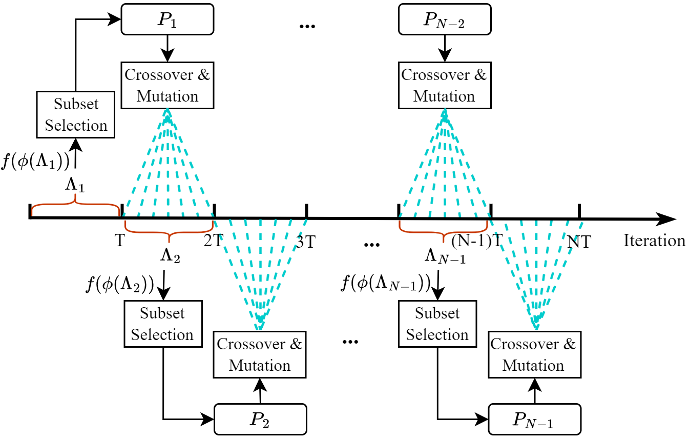

# Evolutionary Preference Sampling for Pareto Set Learning

The overview of the EPS.

This project is a pytorch implementation of *Evolutionary Preference Sampling for Pareto Set Learning*  
## Installation
### Requirements
Our provide the packages file of our environment (requirement.txt), you can using the following command to download the environment:
  -pip install -r requirements.txt
## Parameters
- problem_name: Testing problems. (0: Normal, 1:EPS strategy)
- scalar: Scalarization function (tch2: Tchebycheff function, tch1: Modified Tchebycheff function, cosmos: A Feature fusion method, hv1: hypervolume optimization)
## Training
To train a model with GPU run:
- Using EPS strategy:
```
cd /projects/EPS
python train_net.py --problem_name 'dtlz7' --using_adapt 1
```
- Do not use EPS strategy:
```
cd /projects/EPS
python train_net.py --problem_name 'dtlz7' --using_adapt 0
```
## Citation

you can cite our work if this work is useful for you.
Our paper can be accessed at https://arxiv.org/abs/2404.08414.
